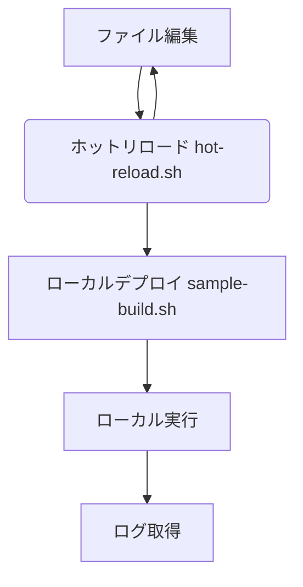

久しぶりの投稿です。[@ry_km](https://twitter.com/ry_km_u_u)です。

突然ですが，AWSのLambda関数開発って皆さんどうやって行なっていますか？コンソールがあるので直打ちしたくなりますよね！？

僕もAWS始めたての頃は，Lambdaコンソールに直接関数を打ち込んでみたり，VSCode(VSC)で編集したファイルをいちいちZipにまとめて手作業でアップロードしてみたり，という感じでした。その後成長しCIツールを使うようになってからは，CloudFormation(CFn)がよしなにS3経由で更新してくれるようになりました。ただし，Lambda関数のデバッグはそれでも難題でした^[バグを解消するたびにいちいちCFnを動かしてコンソール上でデバッグするなど...]。

今回はそんな皆様に朗報です！個人的に最強なLambda関数開発環境を整えたので，ご紹介したいと思います！

# TL;DR
今回の設定ファイルなどは以下のレポジトリに入っています。
https://github.com/ryokm-221/localstack-tflocal-docker

# 今まで困っていたこと
Lambdaユーザー共通の悩みには以下の点があります。
- 普段のコードのように，書く->実行する->デバッグするの流れをなるべく早く行いたい
  - いちいちAWS上にアップロードするのは時間もかかるし面倒
- CloudWatchのログ更新が遅すぎる（orタイミングがわからない）
- コンソールのエディタが使いにくい
  - 手元のVSCで編集したいな

以下ではこれらの点を解消していきます！

# やってみる
今回はNode.jsで開発を行う場合の例になります。
## 前提条件
- Docker
- Node.js
  - 完成品に必要なバージョンに合わせて用意してOKです
- watchman

## ざっくりした仕組み
以下が今回ご紹介する開発方法のざっくりした流れです。ファイル編集からホットリロードでLocalStackにローカルデプロイするのが特徴です！


## 仕組みのご紹介（前半）
### コード編集〜ローカルデプロイ
まずは，お好きなエディタ（VSCなど）でLambda関数を作成します。レポジトリにある例では，DynamoDBと連携する関数を用意しています。
```js:index.js
const aws = require('aws-sdk')
const DynamoDB = new aws.DynamoDB({
  region: 'ap-northeast-1',
  endpoint: process.env.DynamoDBEndpoint
})

// Payload example: { Id: "1234-5678", Item: "banana" }
exports.handler = async (event) => {
  console.log(event)
  const res = await DynamoDB.putItem({
    Item: {
      Id: { S: event.Id },
      Item: { S: event.Item }
    },
    TableName: process.env.DynamoDBTableName
  }).promise()
  return res
}
```

Lambdaをローカルで開発するにあたって，[LocalStack](https://localstack.cloud/)を使用しています。LocalStackは，AWSの各種サービスをローカル環境で使用できるモックフレームワークで無料で使えることがポイントです^[初期の開発環境にわざわざ別のAWSアカウントを区切って料金発生して，ということは避けたいですからね]。先日v1.0に到達し，挙動も安定してきた印象があります^[出典：[AWSの主要サービスをローカルでエミュレート「LocalStack」正式リリース](https://www.itmedia.co.jp/news/articles/2207/25/news099.html)]！

LocalStackはDocker-Composeで利用すると設定が簡単に引き継げます。公式のdocker-compose.ymlが公開されているので，ほとんどそのまま使います。

```yaml:localstack/docker-compose.yml
version: '3.8'

services:
  localstack:
    container_name: localstack_main
    image: localstack/localstack:1.0.3
    ports:
      - "127.0.0.1:4510-4559:4510-4559"
      - "127.0.0.1:4566:4566"
    environment:
      - DEBUG=${DEBUG-}
      - DATA_DIR=${DATA_DIR-}
      - LAMBDA_EXECUTOR=${LAMBDA_EXECUTOR-}
      - HOST_TMP_FOLDER=${TMPDIR:-/tmp/}localstack
      - DOCKER_HOST=unix:///var/run/docker.sock
    volumes:
      - "${TMPDIR:-/tmp}/localstack:/tmp/localstack"
      - "/var/run/docker.sock:/var/run/docker.sock"
```

これを起動します。
```bash
$ docker-compose -f localstack/docker-compose.yml up -d
```

次に，デプロイツールとして[Terraform](https://www.terraform.io/)を利用します。こちらも，Dockerを使えばLocalStackとの連携が楽にできます。ただし，Terraformはアーキテクチャによって異なる実行ファイルが必要なので，x86-64系（IntelPCなど）とARM64系（M1Macなど）で異なるDockerfileを使ってください。
- x86-64系：tflocal/Dockerfile.x86-64
- ARM64系：tflocal/Dockerfile.arm64

以下ビルドコードです。
```bash
$ docker build -t tflocal:0.2 <選んだdockerfile>
```

以上でLocalStackとTerraformが使えるようになりました！

### LocalStackリソースの準備
TerraformでLocalStack内のリソースの準備をします。今回，Lambda関数+DynamoDBの組み合わせを再現したいので，以下のコードを準備しました^[すべてのリソースをベタ打ちしていてベストプラクティスとはかけ離れた書き方をしていますが，サンプルなのでご容赦ください...]。

```hcl:terraform/main.tf
variable "aws_s3_path_style" {
  default = "false"
}

variable "dynamodb_table_name" {
  default = "sample_table"
}

provider "aws" {
  s3_use_path_style = var.aws_s3_path_style
}

resource "aws_dynamodb_table" "db_sample" {
  name = var.dynamodb_table_name
  billing_mode = "PROVISIONED"
  read_capacity = 5
  write_capacity = 5
  hash_key = "Id"

  attribute {
    name = "Id"
    type = "S"
  }
}

resource "aws_iam_role" "func_sample_iam" {
  name = "func_sample_iam"
  assume_role_policy = <<EOF
{
  "Version": "2012-10-17",
  "Statement": [
    {
      "Action": "sts:AssumeRole",
      "Principal": {
        "Service": "lambda.amazonaws.com"
      },
      "Effect": "Allow",
      "Sid": ""
    }
  ]
}
EOF
}

resource "aws_iam_role_policy" "func_sample_iam_policy" {
  name = "dynamodb_access_policy"
  role = aws_iam_role.func_sample_iam.id
  policy = jsonencode({
    Version =  "2012-10-17"
    Statement = [{
      Action = [
        "dynamodb:PutItem",
        "dynamodb:Query"
      ]
      Resource = "*"
      Effect = "Allow"
    }]
  })
}

resource "aws_lambda_function" "func_sample" {
  function_name = "func_sample"
  filename = "lambda_func.zip"
  handler = "index.handler"
  runtime = "nodejs14.x"
  role = aws_iam_role.func_sample_iam.arn
  source_code_hash = filebase64sha256("lambda_func.zip")
  environment {
    variables = {
      DynamoDBEndpoint = "http://localstack:4566"
      DynamoDBTableName = var.dynamodb_table_name
    }
  }
}
```

Lambda関数の設定で`source_code_hash`を取得していますが，これにより後述するホットリロードでファイル更新ができるようになっています！^[ハッシュ値を取得することでファイルの差分を検知しています。]

### ホットリロードの設定
次に今回の記事の目玉である，ホットリロードの設定をします！

ホットリロードでは，[watchman](https://facebook.github.io/watchman/)と呼ばれるファイル監視ツールを使用します。インストール方法は公式サイトから確認してください^[Macの場合はHomebrew経由でインストールできます！]。

LocalStackが公式で用意しているwatchman用の監視スクリプトをほぼそのまま使用しています^[LocalStackの公式レポジトリにあります（[https://github.com/localstack/localstack-pro-samples/blob/master/sample-archive/spring-cloud-function-microservice/bin/watchman.sh](https://github.com/localstack/localstack-pro-samples/blob/master/sample-archive/spring-cloud-function-microservice/bin/watchman.sh)）。]。

```bash:hot-reload.sh
#!/bin/bash -e
### sh hot-reload.sh <path/to/watch/file> <script> ###

if [ $# -ne 2 ]; then
  echo "usage: sh hot-reload.sh <path/to/watch/file> <script>"
  exit 1
fi

trap "watchman watch-del $(pwd)" EXIT

folder="$(pwd)/$1"
echo "watching folder $folder for changes"

while watchman-wait $folder; do
  bash -c "$2"
  watchman watch-del $folder
done
```

実行する際に，引数に監視対象のファイルがあるディレクトリとビルドスクリプトを入れます。今回はZipにまとめてtflocalを呼び出す部分をビルドスクリプトとしました^[普段はLambdaもTypeScriptで開発しているので，例えばtscなんかもここに入れてしまうと便利ですね。]。

```bash:sample-build.sh
#!/bin/bash -e
rm -f terraform/lambda_func.zip
zip "terraform/lambda_func.zip" node_modules/ index.js package.json package-lock.json
npm run build
```

watchmanを実行します。

```bash
$ sh hot-reload.sh <path> "sh sample-build.sh"
watching folder <path> for changes
```

メッセージが表示されたら完了です！

## ここで一度確認
ここまでの設定がうまくいっているか確認してみましょう。

### ホットリロードの確認
`index.js`の何か一部を変えて保存すると，ビルドスクリプトが動いてTerraformが更新してくれますか？

### Lambda関数が実行できるか確認
以下のコードで実行できます。うまく実行できていますか？
```bash
$ alias awslocal='docker run --rm -it -v "$(pwd):/app" --net=localstack_default --env AWS_ACCESS_KEY_ID=dummy --env AWS_SECRET_ACCESS_KEY=dummy --env AWS_DEFAULT_REGION=ap-northeast-1 amazon/aws-cli:2.6.1 --endpoint-url http://localstack:4566'
$ awslocal lambda invoke --function-name func_sample --payload '{ "Id": "test1", "Item": "banana" }' --cli-binary-format raw-in-base64-out /app/result.log
{
    "StatusCode": 200,
    "LogResult": "",
    "ExecutedVersion": "$LATEST"
}
```

## 仕組みのご紹介（後半）
### ログの確認
Lambda関数の開発の難点の一つ，ログ確認もサクッと行いましょう！

LocalStack上で一度Lambda関数を実行すると，本家のAWSと同じようにCloudWatch上にLogGroupが作られます。それを確認して，2回目以降の実行時にリアルタイムで取得するようにできます。

```bash
$ awslocal logs describe-log-groups --query logGroups[0].logGroupName
"/aws/lambda/func_sample"
```

狙ったロググループ名がでない場合は，`logGroups[n]`の数字を変えてみてください。

ロググループ名が得られたら，リアルタイムでログを確認するスクリプトを実行します。

```bash
$ awslocal logs tail --follow "/aws/lambda/func_sample"
```

ここまでできたら，Lambda関数を実行してログを取得してみてください！多少ラグはありますが，CloudWatchよりは早く取得できるようになっているはずです。

### npm scriptsにまとめる
最後に，ここまででてきたスクリプトを`package.json`にまとめて便利に使いましょう！

```json:package.json
{
  // ...
  "scripts": {
    "awslocal": "docker run --rm -it -v \"$(pwd)\":/app --net=localstack_default --env AWS_ACCESS_KEY_ID=dummy --env AWS_SECRET_ACCESS_KEY=dummy --env AWS_DEFAULT_REGION=ap-northeast-1 amazon/aws-cli:2.6.1 --endpoint-url http://localstack:4566",
    "tflocal": "docker run --rm -it -v \"$(pwd)\":/app --net localstack_default tflocal:0.2",
    "localstack:run": "docker-compose -f localstack/docker-compose.yml up -d",
    "test": "npm run awslocal -- lambda invoke --function-name func_sample --payload '{ \"Id\": \"test1\", \"Item\": \"banana\" }' --cli-binary-format raw-in-base64-out /app/result.log",
    "build": "cd terraform && npm run tflocal -- apply -auto-approve",
    "watch:build": "sh hot-reload.sh . \"sh sample-build.sh\"",
    "watch:logs": "npm run awslocal -- logs tail --follow",
    "check:logs": "npm run awslocal -- logs describe-log-groups --query logGroups[0].logGroupName"
  }
  // ...
}
```

それぞれの役割は以下の通りです。

```bash
# LocalStack実行
$ npm run localstack:run

# Lambdaローカル実行
$ npm test

# ホットリロード開始
$ npm run watch:build

# ロググループの確認
$ npm run check:logs

# ログのリアルタイム確認
$ npm run watch:logs
```

# まとめ
以上がぼくのかんがえるさいきょうのLambda関数開発環境になります！とても長くなってしまいました...

なにかより良くなるアイディアなどがありましたら，コメントで教えていただけるととても嬉しいです！また，他の言語版もやってみたいと思います。最後までお読みいただきありがとうございました！